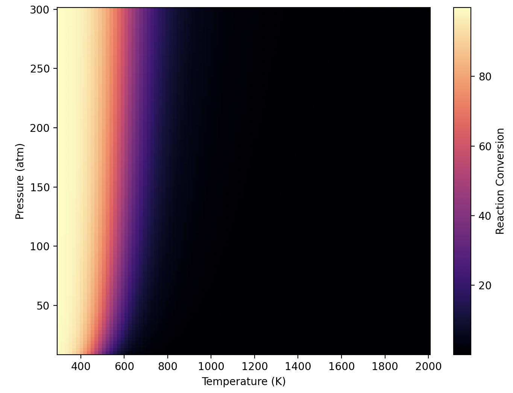

# PyReactor

A conversion modeller for generic (ideal) gas-phase chemical reactions. Models the equilibrium conversion based on temperature, pressure, and thermodynamic properties of the reactants and products defined by the user.

## Overview 
The conversion of a gas phase reaction is calculated via the following steps:

1. Reaction components are defined. This includes the reaction order of reach component as well as shomate equation coefficients for heat capacity. 
2. Using basic thermodynamic data (reaction temperature, standard enthalpy and entropy change), a temperature dependant equilibrium constant is calculated.
4. Using the equilibrium constant and a user specified pressure, a conversion is calculated the reaction quotient.

## Inputs

- Reactant and product species with stoichiometric coefficients and shomate heat capacity coefficients.
- Standard reaction enthalpy ($\Delta H^{\ominus}$) and entropy ($\Delta S^{\ominus}$) per mole of reaction.
- Initial mole counts of all reactants and products.
- Reaction temperature (K) and pressure (atm).

## Output

- Equilibrium conversion $\chi$ of the reaction.
- Optional pressure-temperature conversion heatmap (as `.svg`).

Below is an example output graph for an idealised Haber process:

## Classes

`pyreactor` defines two main classes to handle reactions, `Component` and `Reaction`.

### `Component`

This class is used to define any chemical species that appears in the reaction equation. 

Class attributes:

- `name`: Name to keep track of component.
- `order`: Stoichiometric coefficient for that component (always positive).
- `cp_coeffs`: Shomate equation coeffieincts for heat capacity.

Class methods:

- `enthalpy_change`: Calculates the enthalpy change due to sensible heat.
- `entropy_change`: Calcuates entropy change due to sensible heat.

### `Reaction`

This class represents a chemical reaction and provides methods to model thermodynamic behavior and equilibrium state.

Class attributes:

- `reactants`: List of `Component` objects acting as reactants.
- `products`: List of `Component` objects acting as products.
- `rxn_std_dh`: Standard enthalpy change per mole of the reaction.
- `rxn_std_ds`: Standard entropy change per mole of the reaction.
- `eos`: Equation of state used (as a string).
- `reac_temp`: Reaction temperature in Kelvin.

Class methods:

- `calculate_rxn_gibbs`: Computes temperature dependant free energy change per mole of reaction.
- `calculate_rxn_k`: Returns temperature dependant equilibrium constant.
- `reaction_equation`: Constructs the pressure-dependent reaction quotient.
- `calculate_conversion`: Solves for the equilibrium conversion (extent of reaction).

## Requirements

- Python 3.10+
- numpy
- scipy
- matplotlib (for visualization)

## Usage

See `example.py` for example usage of conversion calculations for the Haber process.

## Notes

- Stoichiometry is handled via the `order` argument in each `Component`
- The tool assumes ideal gas behavior
- Root-finding uses `scipy.optimize.root_scalar` (Brent’s method)
- Divergences due to poles (division by zero or log of negative numbers) are avoided via dynamic bracketing
